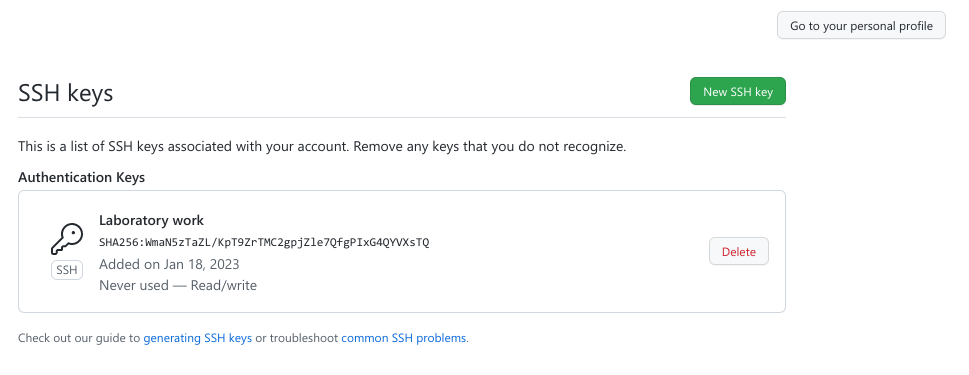
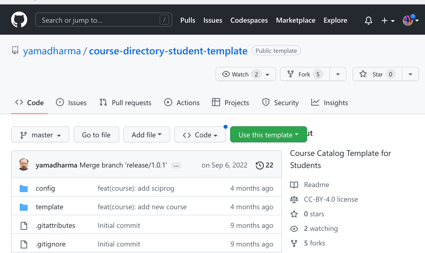
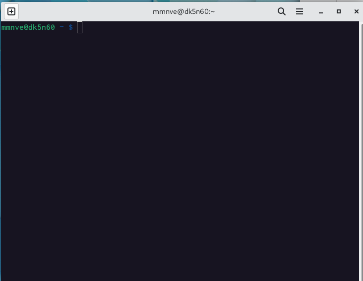

---
## Front matter
title: "Шаблон отчёта по лабораторной работе"
subtitle: "N 01"
author: "НВЕ МАНГЕ ХОСЕ ХЕРСОН МИКО, Группа: НКАбд-03-22"

## Generic otions
lang: ru-RU
toc-title: "Содержание"

## Bibliography
bibliography: bib/cite.bib
csl: pandoc/csl/gost-r-7-0-5-2008-numeric.csl

## Pdf output format
toc: true # Table of contents
toc-depth: 2
lof: true # List of figures
lot: true # List of tables
fontsize: 12pt
linestretch: 1.5
papersize: a4
documentclass: scrreprt
## I18n polyglossia
polyglossia-lang:
  name: russian
  options:
	- spelling=modern
	- babelshorthands=true
polyglossia-otherlangs:
  name: english
## I18n babel
babel-lang: russian
babel-otherlangs: english
## Fonts
mainfont: PT Serif
romanfont: PT Serif
sansfont: PT Sans
monofont: PT Mono
mainfontoptions: Ligatures=TeX
romanfontoptions: Ligatures=TeX
sansfontoptions: Ligatures=TeX,Scale=MatchLowercase
monofontoptions: Scale=MatchLowercase,Scale=0.9
## Biblatex
biblatex: true
biblio-style: "gost-numeric"
biblatexoptions:
  - parentracker=true
  - backend=biber
  - hyperref=auto
  - language=auto
  - autolang=other*
  - citestyle=gost-numeric
## Pandoc-crossref LaTeX customization
figureTitle: "Рис."
tableTitle: "Таблица"
listingTitle: "Листинг"
lofTitle: "Список иллюстраций"
lotTitle: "Список таблиц"
lolTitle: "Листинги"
## Misc options
indent: true
header-includes:
  - \usepackage{indentfirst}
  - \usepackage{float} # keep figures where there are in the text
  - \floatplacement{figure}{H} # keep figures where there are in the text
---

# Цель работы

Цель этой работы - получить практические знания об установке операционной
системы на виртуальный машине в этом случае «Fedora», настройке служб,
необходимых для дальнейшей работы сервисов.

# Ход работы:

1. Прежде всего мы настраиваем имя виртуальной машины и выбираем тип и
версию нашего дистрибутива.

{ #fig:fig1 width=110%}

2. Настройка объема оперативной памяти с 2048 МБ (в нашем случае 3084 МБ)

![Ресунек ]2(image/1.2.png){ #fig:fig2 width=110%}

3. Задаём конфигурацию жесткого диска– VDI (VirtualBox Disk Image)

{ #fig:fig3 width=110%}

4. Задаём размер диска от 80 ГБ

{ #fig:fig4 width=110%}

5. Увеличение доступного объема видеопамяти до 128 МБ

{ #fig:fig5 width=110%}

6. Во вкладке Носители добавляем новый оптический дисковод и выбираем наш
образ Linux-Fedora с компьютера

{ #fig:fig6 width=110%}

7. Запуск виртуальной машины и начало установки системы (Рисунок 8,9).
1. Мы выбираем верхний вариант «Start Fedora-workstation-live 36», затем
нажимаем "Install to hard drive".

{ #fig:fig7 width=110%}

8. Настройка системного языка, языка ввода и времени

{ #fig:fig8 width=110%}

9. Выбор диска, на который будем устанавливать нашу операционную систему,
затем мы нажимаем начать установку

{ #fig:fig9 width=110%}

10. Мы ждем окончания установки, затем нажимаем завершить установку

{ #fig:fig10 width=110%}

11. после установки мы завершаем сеанс виртуальной машины, удаляем образ диска
из дисковода

{ #fig:fig11 width=110%}

12. Мы запускаем виртуальную машину, в которой мы должны создать нового
пользователя (логин пользователя совпадает с логином студента в дисплейном
классе) и настройкой пароля 

{ #fig:fig12 width=110%}

14. Вывод работы:
в этой части мы узнали, как правильно настроить и установить операционную
систему на виртуальной машине.

# IV. Выводы, согласованные с целью работы:

- В этой лабораторной работе, мы узнали, как правильно настроить и установить
операционную систему на виртуальной машине и после этого мы узнали, как
установить программное обеспечение через терминал с помощью команд, мы
попытались установить три программного обеспечения, из которых одно уже
установлено

::: {#refs}
:::
