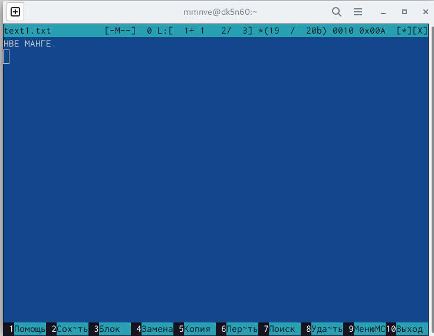

---
## Front matter
title: "Шаблон отчёта по лабораторной работе"
subtitle: "N 2"
author: "НВЕ МАНГЕ ХОСЕ ХЕРСОН МИКО, Группа: НКАбд-03-22"

## Generic otions
lang: ru-RU
toc-title: "Содержание"

## Bibliography
bibliography: bib/cite.bib
csl: pandoc/csl/gost-r-7-0-5-2008-numeric.csl

## Pdf output format
toc: true # Table of contents
toc-depth: 2
lof: true # List of figures
lot: true # List of tables
fontsize: 12pt
linestretch: 1.5
papersize: a4
documentclass: scrreprt
## I18n polyglossia
polyglossia-lang:
  name: russian
  options:
	- spelling=modern
	- babelshorthands=true
polyglossia-otherlangs:
  name: english
## I18n babel
babel-lang: russian
babel-otherlangs: english
## Fonts
mainfont: PT Serif
romanfont: PT Serif
sansfont: PT Sans
monofont: PT Mono
mainfontoptions: Ligatures=TeX
romanfontoptions: Ligatures=TeX
sansfontoptions: Ligatures=TeX,Scale=MatchLowercase
monofontoptions: Scale=MatchLowercase,Scale=0.9
## Biblatex
biblatex: true
biblio-style: "gost-numeric"
biblatexoptions:
  - parentracker=true
  - backend=biber
  - hyperref=auto
  - language=auto
  - autolang=other*
  - citestyle=gost-numeric
## Pandoc-crossref LaTeX customization
figureTitle: "Рис."
tableTitle: "Таблица"
listingTitle: "Листинг"
lofTitle: "Список иллюстраций"
lotTitle: "Список таблиц"
lolTitle: "Листинги"
## Misc options
indent: true
header-includes:
  - \usepackage{indentfirst}
  - \usepackage{float} # keep figures where there are in the text
  - \floatplacement{figure}{H} # keep figures where there are in the text
---

# Цель работы

Знакомство с операционной системой, как обращаться с ней через командные
строки, что включает в себя понимание каталогов, организацию файловой системы,
навигацию по файловой системе, создание и удаление файлов и каталогов.

Ход работы:
a. Порядок выполнения работы:
- Перемещение по файловой системе:
1. знакомство с командами (pwd, ls, cd):
-  Мы открываем терминал, мы проверяем, находимся ли мы в домашнем
каталоге, который представлен символом "~", после подтверждения этого
и с помощью команды "pwd" мы смогли узнать полный путь к
домашнему каталогу

{ #fig:fig1 width=110%}

- используя команду "cd", мы смогли ввести файл "Documents" с
относительным путем, потому что файл был расположен в домашнем
каталоге с путем "/home/amugari/", затем мы перешли в каталог "local",
который является подкаталогом каталога "usr" с абсолютным путем,
потому что начинается с "/"

{ #fig:fig2 width=110%}

- из нашего каталога " /tmp/local" мы ввели команду cd с ключом "-", которая
возвращает нас в последний каталог, в котором мы были, когда мы вводили
команду "cd ..", которая выводит нас на один каталог выше. после исключения
обеих команд мы оказались в домашнем каталоге.

{ #fig:fig3 width=110%}

- на этом шаге нам не нужно было вызывать "cd", потому что мы были в
домашнем каталоге, мы выполнили команду "ls", чтобы увидеть список
файлов домашнего каталога, затем мы подтвердили его наличие,
запустив графический файловый менеджер, выполнив команду "nautilus"

{ #fig:fig4 width=110%}

- Здесь мы отобразили список файлов подкаталога домашнего каталога с
относительным путем, затем мы отобразили список файлов каталога
"/local", используя абсолютный путь. Эти два шага показывают, что
команда "ls" работает как с абсолютным, так и с относительным путем

{ #fig:fig5 width=110%}

- выполнение команды "ls -R"

{ #fig:fig6 width=110%}

- выполнение команды "ls -a"

{ #fig:fig7 width=110%}

- выполнение команды "ls -is"

{ #fig:fig8 width=110%}

# Создание пустых каталогов и файлов:
1. знакомство с командой (mkdir):
- в домашнем каталоге мы создали каталог "parentdir", затем мы проверили
это с помощью команды "ls", после чего мы создали другой каталог "dir"
внутри "parentdir"

{ #fig:fig9 width=110%}

- На этом шаге мы смогли создать несколько каталогов внутри "parentdir",
указав несколько аргументов 

{ #fig:fig10 width=110%}

- Здесь мы создали подкаталог "newdir" в каталоге (~), отличном от того, в
котором мы находились (/ home /amugari / parentdir), после этого с
помощью команды "mkdir -p" мы создали два каталога в "newdir", один
внутри другого (иерархия), после этого мы проверили, что с помощью
команда "ls -R", которая рекурсивно отображает файлы, включенные в
текущий каталог

{ #fig:fig11 width=110%}

- Используя команду "touch", мы смогли создать файл с форматом (.txt) в
каталоге "~/newdir/dir1/dir2/", после чего мы проверили его существование
с помощью команды "ls"

{ #fig:fig12 width=110%}

# Перемещение и удаление файлов или каталогов:
a. Знакомство с командой (rm, mv, cp):
- Здесь мы удалили все файлы в каталоге "dir2" в формате ".txt", используя
команду "rm -i" 

- на этом шаге мы рекурсивно удалили каталог "newdir" и в той же команде
мы также удалили все файлы, начинающиеся с "dir" и расположенные в
каталоге "~/parentdir"

{ #fig:fig13 width=110%}

- на этом шаге мы рекурсивно удалили каталог "newdir" и в той же команде
мы также удалили все файлы, начинающиеся с "dir" и расположенные в
каталоге "~/parentdir

{ #fig:fig14 width=110%}

- На этом шаге мы переименовали два файла, используя команды "mv" и "cr"

{ #fig:fig15 width=110%}

- На этом шаге мы изменили имя каталога "dir1", расположенного в
"parentdir1", на "newdir", используя команду "mv"

{ #fig:fig16 width=110%}

- Команда cat: вывод содержимого файлов:
на этом шаге мы отобразили содержимое файла с помощью команды "cat"

{ #fig:fig17 width=110%}

#b. Задание для самостоятельной работы:
#i. Первое задание:

{ #fig:fig18 width=110%}

Узнать полный путь директории к своей домашней директории

#ii. Второе задание:

{ #fig:fig19 width=110%}

- Вывод команды “pwd” при переходе в каталоге “tmp” даёт разный результат, потому
что первый каталог “tmp” и второй является разными, первый каталог находится в
домашней директории, а второй находится в корневой директории

## iii третье задание:

{ #fig:fig20 width=110%}

{ #fig:fig21 width=110%}

{ #fig:fig22 width=110%}

{ #fig:fig23 width=110%}

## Четвёртое задание:

{ #fig:fig24 width=110%}

- используя команду "mkdir", мы создали два каталога "temp" & labs, последний
содержит три подкаталога "lab1", "lab2", "lab3", а внутри каталога "temp" мы
создали три файла в формате .txt с помощью команды touch. наконец, мы проверили
проделанную работу с помощью команды "ls".

# Пятое задание:

{ #fig:fig25 width=110%}

- используя текстовый редактор "mcedit", мы смогли записать имя внутри файла
text1.txt

{ #fig:fig26 width=110%}

- здесь мы написали фамилию

{ #fig:fig27 width=110%}

- Мы написали идентификатор группы

{ #fig:fig28 width=110%}

- и здесь мы отобразили содержимое трех файлов, которые мы отредактировали с
помощью "mcedit", используя команду "cat"

{ #fig:fig29 width=110%}

# a. Первая часть:

{ #fig:fig30 width=110%}

- В этой части мы скопировали все файлы в формате .txt из каталога "~/temp" в каталог
"labs" командой "cp", затем мы проверили это командой "ls".

{ #fig:fig31 width=110%}

- На этом шаге мы изменили имя текстовых файлов с помощью команды "mv", а
затем переместили их в разные файлы с помощью "mv". После этого мы рекурсивно
проверили это с помощью "ls -R" и воспроизвели это с помощью "cat".

# b. Вторая часть :

# Вывод лабораторной работы:
- в этой лабораторной работе мы узнали, как использовать различные
команды в linux, я научился работать с интерфейсом командной строки
GNU OC Линукс. В результате лабораторной работы я овладел
практическими навыками общения с операционной системой на уровне
командной строки, научился использовать команды: pwd, cd, mkdir,
touch, rm, cp, ls, cat. mcedit.

::: {#refs}
:::
