---
## Front matter
title: "Шаблон отчёта по лабораторной работе"
subtitle: "No 5"
author: "НВЕ МАНГЕ ХОСЕ ХЕРСОН МИКО, Группа: НКАбд-03-22 "

## Generic otions
lang: ru-RU
toc-title: "Содержание"

## Bibliography
bibliography: bib/cite.bib
csl: pandoc/csl/gost-r-7-0-5-2008-numeric.csl

## Pdf output format
toc: true # Table of contents
toc-depth: 2
lof: true # List of figures
lot: true # List of tables
fontsize: 12pt
linestretch: 1.5
papersize: a4
documentclass: scrreprt
## I18n polyglossia
polyglossia-lang:
  name: russian
  options:
	- spelling=modern
	- babelshorthands=true
polyglossia-otherlangs:
  name: english
## I18n babel
babel-lang: russian
babel-otherlangs: english
## Fonts
mainfont: PT Serif
romanfont: PT Serif
sansfont: PT Sans
monofont: PT Mono
mainfontoptions: Ligatures=TeX
romanfontoptions: Ligatures=TeX
sansfontoptions: Ligatures=TeX,Scale=MatchLowercase
monofontoptions: Scale=MatchLowercase,Scale=0.9
## Biblatex
biblatex: true
biblio-style: "gost-numeric"
biblatexoptions:
  - parentracker=true
  - backend=biber
  - hyperref=auto
  - language=auto
  - autolang=other*
  - citestyle=gost-numeric
## Pandoc-crossref LaTeX customization
figureTitle: "Рис."
tableTitle: "Таблица"
listingTitle: "Листинг"
lofTitle: "Список иллюстраций"
lotTitle: "Список таблиц"
lolTitle: "Листинги"
## Misc options
indent: true
header-includes:
  - \usepackage{indentfirst}
  - \usepackage{float} # keep figures where there are in the text
  - \floatplacement{figure}{H} # keep figures where there are in the text
---

# Цель работы

В пятой лабораторной работе мы рассмотрим, как освоить процедуру компи-
ляции и сборки программ, написанных на ассемблере nasm.

# Выполнение лабораторной работы :

## Программа Hello world! :
- В этом разделе мы хотели создать программу, которая выводит строку “Hello
world!” но на языке ассемблера nasm.
- Вот почему мы начали с рекурсивного создания нового каталога
“~/work/arch-pc/lab05”

(рис. [-@fig:fig1)

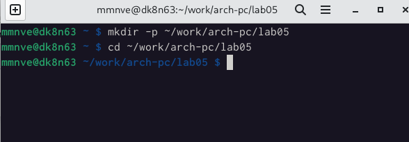{ #fig:fig1 width=110%}

\
\

- После этого мы создали текстовый файл в формате .asm, затем открываем
только что созданный файл с помощью текстового редактора gedit.рис. [-@fig:fig2)

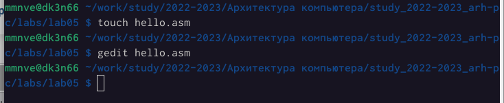{ #fig:fig2 width=110%}

- После этого мы добавили код сборки, который выводит “Hello world!” в
файл hello.asm.рис. [-@fig:fig3)

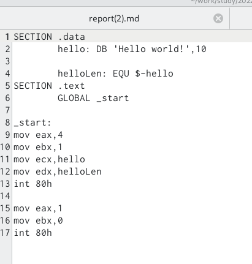{ #fig:fig3 width=110%}

## ранслятор NASM :

- На этом этапе, используя переводчик NASM, мы смогли скомпилировать или
перевести код в объектный код, который создал другой файл с форматом.рис. [-@fig:fig4)
 
 { #fig:fig4 width=110%}
 
- Используя команду ls, мы проверили работу, проделанную переводчиком,
и обнаружили, что объектный файл был создан с тем же именем, что и
текстовый файл.

## асширенный синтаксис командной строки NASM :

- Здесь мы запустили полную команду NASM и проверили выходные файлы,
которые дала нам.Разница заключалась в том, что с помощью полной ко-
манды нам нужно указать имя объектного файла и список файлов, и это то,
что получилось после проверки с помощью запятой ls.(рис. [-@fig:fig5)

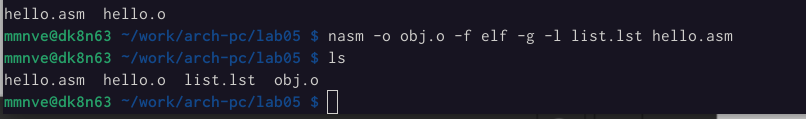{ #fig:fig5 width=110%}

## Компоновщик LD :

- На этом шаге и с помощью компоновщика с командой ld мы смогли по-
лучить исполняемый файл, обработав объектный файл. Затем,используя
команду ls, мы проверили, что файл был создан. рис. [-@fig:fig6)

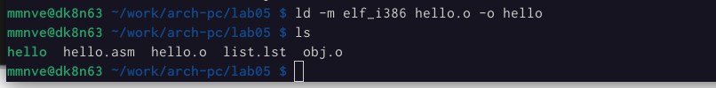{ #fig:fig6 width=110%}

- Затем мы проверили, что можем присвоить исполняемому файлу любое
имя, а не только то же имя, что и объектному файлу, как показано с помощью
команды ls.рис. [-@fig:fig7)

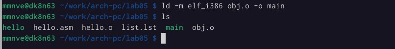{ #fig:fig7 width=110%}

- сполняемый файл имеет имя “main”, а для объектного файла - “obj”.

## апуск исполняемого файла :

- На этом шаге все, что мы сделали, это запустили исполняемый файл.рис. [-@fig:fig8)

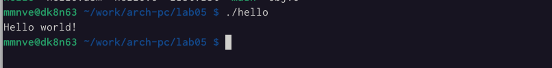{ #fig:fig8 width=110%}

## Выводы по результатам выполнения заданий:

- В этой лабораторной работе мы освоили, как скомпилировать текстовый
файл, написанный на языке ассемблера NASM, в объектный файл, затем получить оправдание, и все это ради создания программы, которая печатает знаменитое предложение “Hello world!”

# Задание для самостоятельной работы :

 1. В каталоге ~/work/arch-pc/lab05 мы создали копию для файла hello.asm и
присвоили ему имя lab05. рис. [-@fig:fig9)

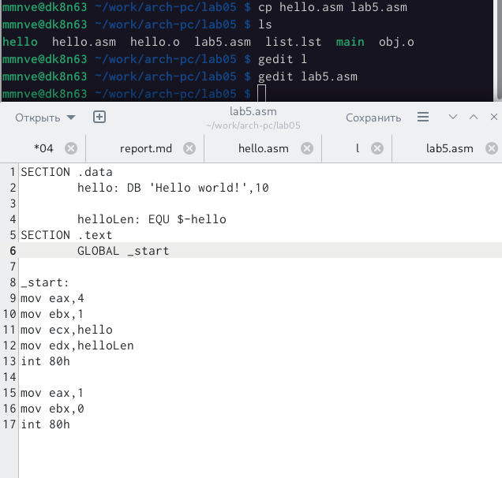{ #fig:fig9 width=110%}

 2. Используя текстовый редактор gedit, мы изменили текстовый файл, содер-жащий ассемблерный код, чтобы программа выводила мое имя и фамилию “Mougari Abderrahim”.рис. [-@fig:fig10)

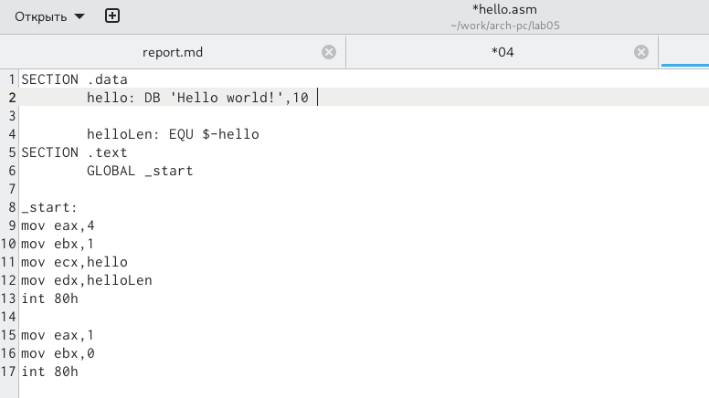{ #fig:fig10 width=110%}

## истинг написанной программы :

SECTION .data

	nfname: DB ‘jose gerson’,10
	
	
  nfnameLen: EQU $-nfname
SECTION .text
GLOBAL _start
 _start:

mov eax,4
mov ebx,1
mov ecx,nfname
mov edx,nfnameLen
int 80h

mov eax,1
mov ebx,0
int 80h

3. После написания кода e скомпилировал код в объектный файл после чего
получил исполняемый файл с помощью компоновщика. рис. [-@fig:fig11)

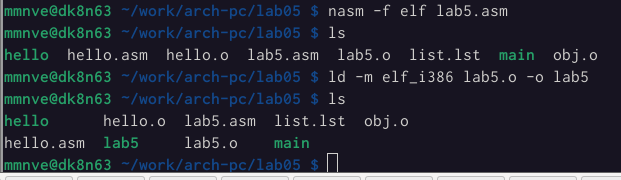{ #fig:fig11 width=110%}

- Затем мы запустили исполняемый файл. рис. [-@fig:fig12)

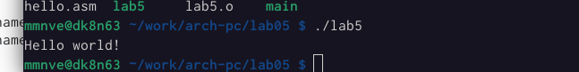{ #fig:fig12 width=110%}

  - Здесь мы скопировали оба hello.Asm и lab5.asm в ваш локальный репози-
торий. рис. [-@fig:fig13)

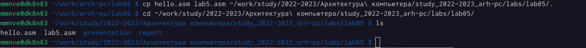{ #fig:fig13 width=110%}

  - Наконец, мы загрузили все файлы в удаленный репозиторий. рис. [-@fig:fig14)

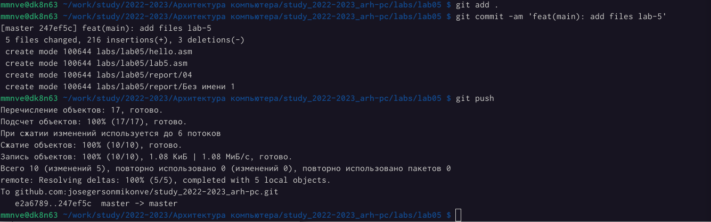{ #fig:fig14 width=110%}

## Выводы по результатам выполнения заданий :

- В этих упражнениях мы применили навыки, полученные в ходе лабора-торной работы, в ходе которой получили более глубокое представление об
именах регистров и о том, как выделить для них память.

# ыводы, согласованные с целью работы :

- В шестой лабораторной работе мы можем получить практические навыки
по созданию компиляции и обработке программы с использованием языка
ассемблера Nasm.

