---
## Front matter
title: "Шаблон отчёта по лабораторной работе"
subtitle: "No 07"
author: "НВЕ МАНГЕ ХОСЕ ХЕРСОН МИКО, Группа: НКАбд-03-22"

## Generic otions
lang: ru-RU
toc-title: "Содержание"

## Bibliography
bibliography: bib/cite.bib
csl: pandoc/csl/gost-r-7-0-5-2008-numeric.csl

## Pdf output format
toc: true # Table of contents
toc-depth: 2
lof: true # List of figures
lot: true # List of tables
fontsize: 12pt
linestretch: 1.5
papersize: a4
documentclass: scrreprt
## I18n polyglossia
polyglossia-lang:
  name: russian
  options:
	- spelling=modern
	- babelshorthands=true
polyglossia-otherlangs:
  name: english
## I18n babel
babel-lang: russian
babel-otherlangs: english
## Fonts
mainfont: PT Serif
romanfont: PT Serif
sansfont: PT Sans
monofont: PT Mono
mainfontoptions: Ligatures=TeX
romanfontoptions: Ligatures=TeX
sansfontoptions: Ligatures=TeX,Scale=MatchLowercase
monofontoptions: Scale=MatchLowercase,Scale=0.9
## Biblatex
biblatex: true
biblio-style: "gost-numeric"
biblatexoptions:
  - parentracker=true
  - backend=biber
  - hyperref=auto
  - language=auto
  - autolang=other*
  - citestyle=gost-numeric
## Pandoc-crossref LaTeX customization
figureTitle: "Рис."
tableTitle: "Таблица"
listingTitle: "Листинг"
lofTitle: "Список иллюстраций"
lotTitle: "Список таблиц"
lolTitle: "Листинги"
## Misc options
indent: true
header-includes:
  - \usepackage{indentfirst}
  - \usepackage{float} # keep figures where there are in the text
  - \floatplacement{figure}{H} # keep figures where there are in the text
---

# Цель работы

   В седьмой лабораторной работе можно будет освоить арифметические опе-
рации языка ассемблера.

# Выполнение лабораторной работы :

## Символьные и численные данные в NASM :

1. Здесь мы начали с создания, а затем переместились в седьмой каталог ла-
боратории “~/work/arch-pc/lab07”, после чего мы создали файл “lab7-1.asm”.(рис. [-@fig:fig1)
 
 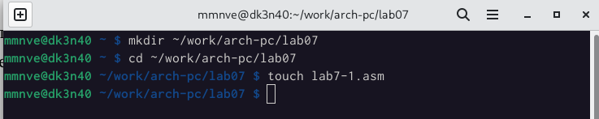{ #fig:fig1 width=110%}
 
 /
 /
 
 2. После этого мы заполнили файл .asm кодом программы, отображающей
значение регистра eax.(рис. [-@fig:fig2)

 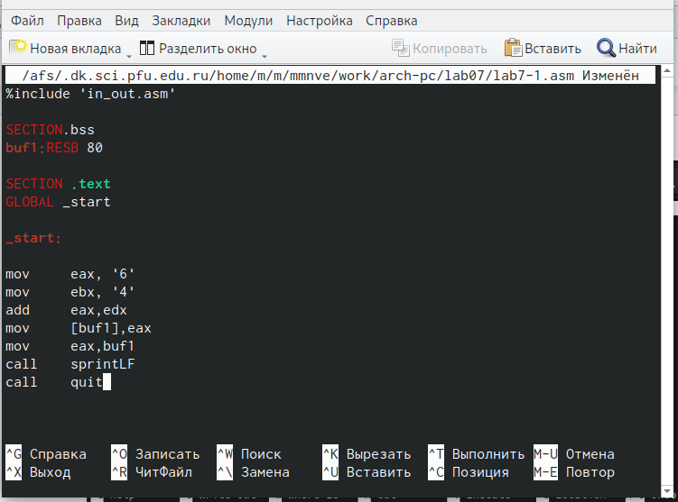{ #fig:fig2 width=110%}
 
- Затем мы скомпилировали файл, создали исполняемый файл и запустили
программу, все это после перемещения файла in_out.asm в тот же каталог,
где находится lab7-1.asm.(рис. [-@fig:fig3)
 
 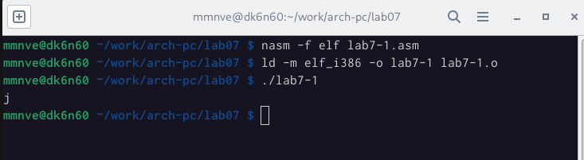{ #fig:fig3 width=110%}
 
 3. После этого мы изменили код в листинге следующим образом : mov eax,6
mov ebx,4. (рис. [-@fig:fig4)
 
 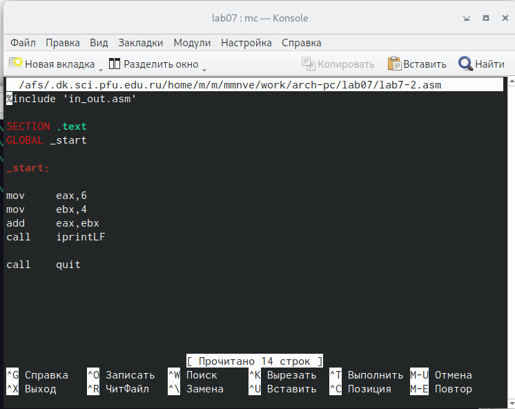{ #fig:fig4 width=110%}
 
- Затем мы снова скомпилировали файл и создали исполняемый файл.(рис. [-@fig:fig5)
 
 { #fig:fig5 width=110%}
 
- Проверив ASCII tbale символ, соответствующий коду 10 это новая строка,
и мы можем сказать, что это было отображено, потому что при запуске
программы она отобразила новую строку в качестве вывода.

4. После этого мы создали файл lab-2.asm, в котором мы использовали под-
программы, расположенные в файле in_out.asm.(рис. [-@fig:fig6)

{ #fig:fig6 width=110%}

- После этого мы заполнили файл необходимым кодом для вывода значения
реестра с помощью подпрограммы. (рис. [-@fig:fig7)

 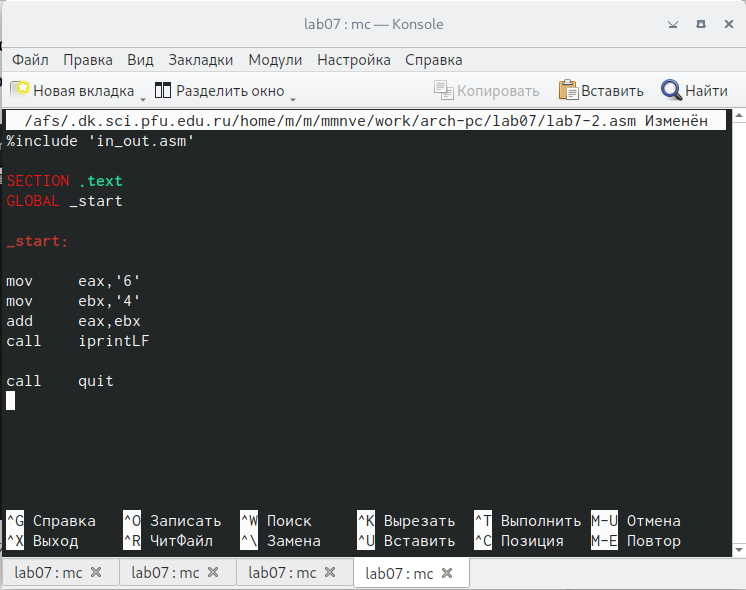{ #fig:fig7 width=110%}
 
- мы скомпилировали файл, создали исполняемый файл и запустили его.(рис. [-@fig:fig8)

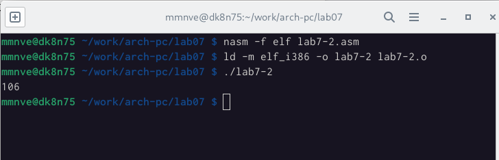{ #fig:fig8 width=110%}

5. Аналогично предыдущему примеру, мы меняем символы на цифры,
заменяя строки на :
mov eax,6
mov ebx,4
(рис. [-@fig:fig9)

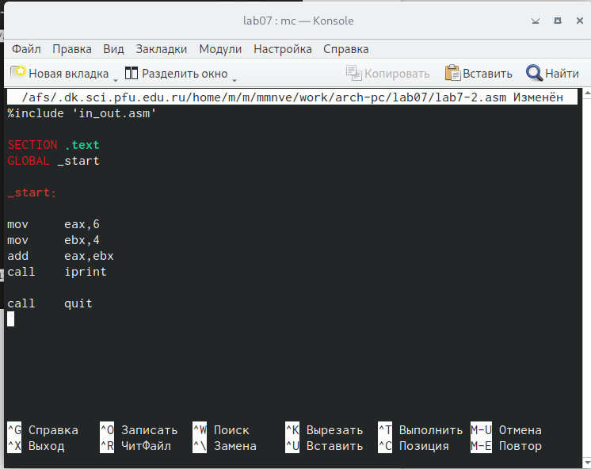{ #fig:fig9 width=110%}

- Затем мы снова скомпилировали файл и создали исполняемый файл.(рис. [-@fig:fig10)

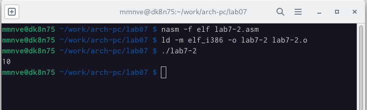{ #fig:fig10 width=110%}

- На этот раз результатом, который мы получили, действительно было добав-
ление 6 и 4 который 10.
- Затем мы заменили функцию iprintLF на iprint. После этого был создан
исполняемый файл, и мы запустили его.(рис.[-@fig:fig11) (рис. [-@fig:fig12)

{ #fig:fig11 width=110%}

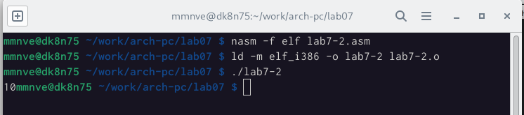{ #fig:fig12 width=110%} 

- Когда мы использовали подпрограмму iprint, мы заметили, что вывод отли-
чается от предыдущего,потому что при использовании iprint не создается
новая строка после вывода.

## Выполнение арифметических операций в NASM :

1. В качестве примера выполнения арифметических операций в NASM при-
ведем программу вычисления арифметического выражения
𝑓(𝑥) = (5 ∗ 2 + 3)/3

- Мы создали файл lab7-3.asm в каталоге ~/work/arch-pc/lab07.(рис [-@fig:fig13)

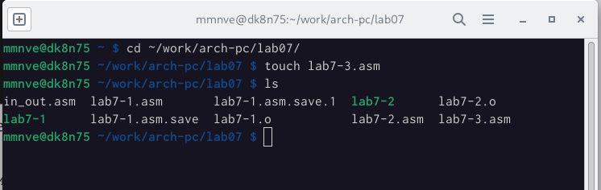{ #fig:fig13 width=110%}

2. Затем мы заполнили файл необходимым кодом.(рис. [-@fig:fig14)

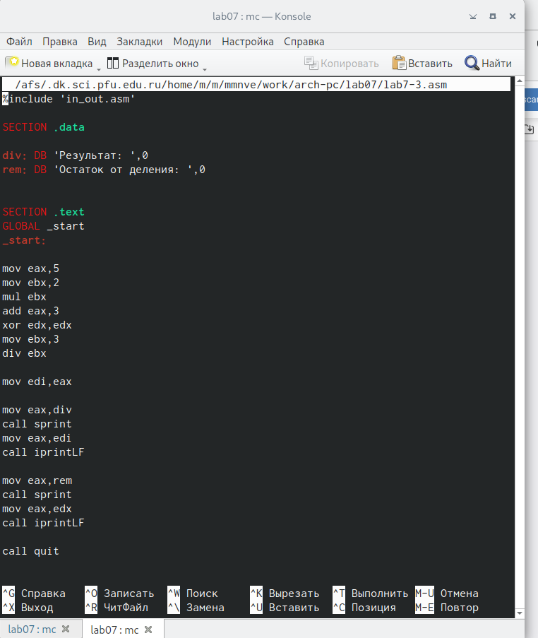{ #fig:fig14 width=110%}

- Создали исполняемый файл и запустили его. 

( рис.[-@fig:fig15)

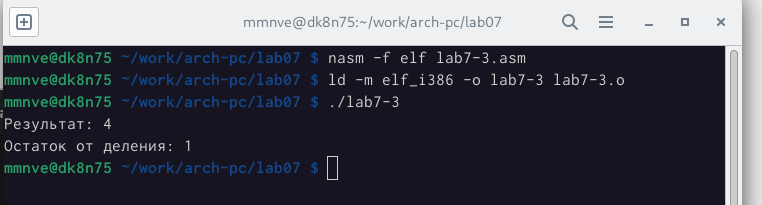{ #fig:fig15 width=110%}

- Затем мы изменили текст программы, чтобы вычислить выражение:
 𝑓(𝑥) = (4 ∗ 6 + 2)/5. 
 
 (рис. [-@fig:fig16)

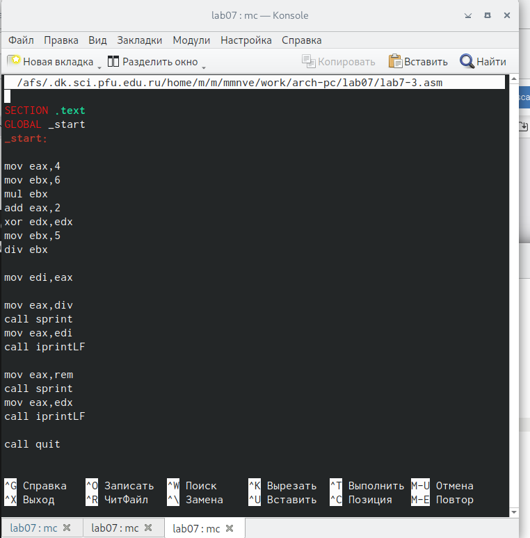{ #fig:fig16 width=110%}

- мы создали исполняемый файл и проверили его работу.(рис. [-@fig:fig17)

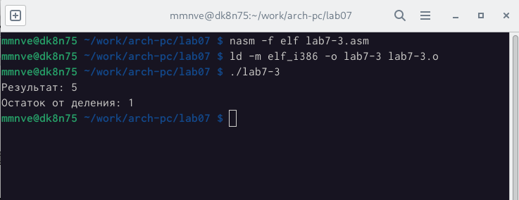{ #fig:fig17 width=110%}

3. На этом шаге мы написали программу, которая может вычислить диспер-
сию, которую мы получаем из номера студенческого билета.

- Мы начали с создания файла variant.asm.(рис. [-@fig:fig18)

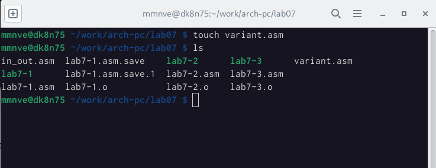{ #fig:fig18 width=110%}

- После этого мы написали код программы. (рис. [-@fig:fig19)

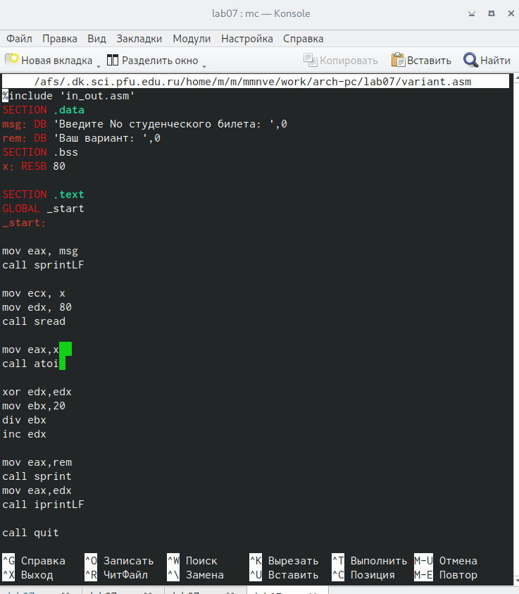{ #fig:fig19 width=110%}

- мы создали исполняемый файл и проверили его работу, и действительно, в
зависимости от номера студента он генерирует номер варианта. (рис. [-@fig:fig20)

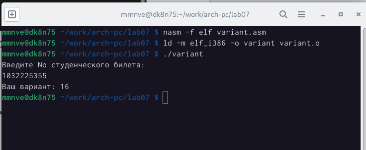{ #fig:fig20 width=110%}

 
## Вопросы :

1. Какие строки листинга 7.4 отвечают за вывод на экран сообщения ‘Ваш
вариант:’?
O:
rem: DB ‘Ваш вариант:’,0
mov eax,rem
call sprint
2. Для чего используется следующие инструкции?
mov ecx, x
mov edx, 80
call sread

O: Эти инструкции были использованы для того, чтобы позволить пользовате-
лю вводить данные
3. Для чего используется инструкция “call atoi”?
O: Эта инструкция используется для преобразования значения x из ASCII-кода
в целое число.

4. Какие строки листинга 7.4 отвечают за вычисления варианта?
O:
xor edx,edx
mov ebx,20
div ebx
inc edx
5. В какой регистр записывается остаток от деления при выполнении ин-
струкции “div ebx”?
O:Остаток был записан в регистре edx
6. Для чего используется инструкция “inc edx”?
O: Эта инструкция была использована для увеличения значения в регистре edx
7. Какие строки листинга 7.4 отвечают за вывод на экран результата вычис-
лений?
O:
mov eax,edx
call iprintLF

## Выводы по результатам выполнения заданий :

- В ходе лабораторной работы мы освоили выполнение арифметических опе-
раций на языке ассемблера и углубились в использование подпрограммы.

# Задание для самостоятельной работы :

1. В этой работе нам пришлось написать программу, которая просит пользо-
вателя ввести значение переменной и решить математическое выражение.
- Мой вариант : 13
- математическое выражение (8𝑥 + 6) ⋅ 10
- Итак, мы начали с создания asm-файла, в котором будет находиться нашкод.(рис. [-@fig:fig21)

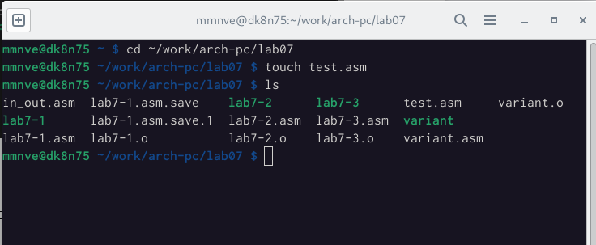{ #fig:fig21 width=110%}

- После этого мы написали код нашей программы. (рис. [-@fig:fig22)

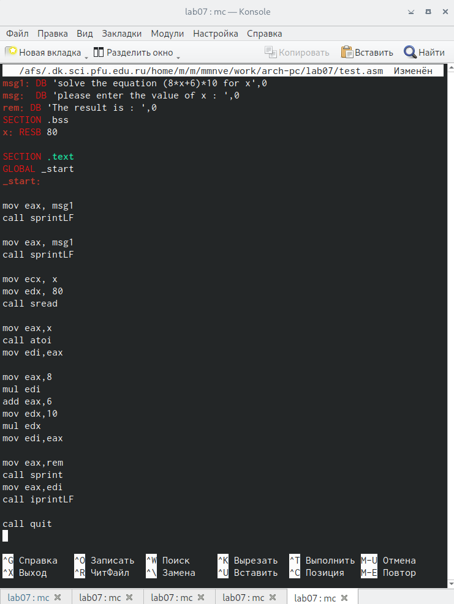{ #fig:fig22 width=110%}

- и, наконец, мы проверяем корректность кода, который мы написали, ис-
пользуя два разных значения.
𝑥1 = 1
𝑥2 = 4

Как указано на следующем рисунке.(рис. [-@fig:fig23)

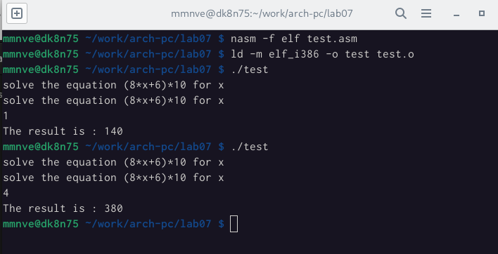{ #fig:fig23 width=110%}

## Выводы по результатам выполнения заданий :

- В этой части мы смогли узнать, как преобразовать некоторые математические
идеи в реальный код на ассемблере, что помогло нам получить более глубокое
представление о том, как работать с регистрами.

# Выводы, согласованные с целью работы :
- В седьмой лаборатории мы в основном научились писать программы, вы-
полняющие арифметические операции, и научились вычислять математи-
ческие выражения средней сложности.

