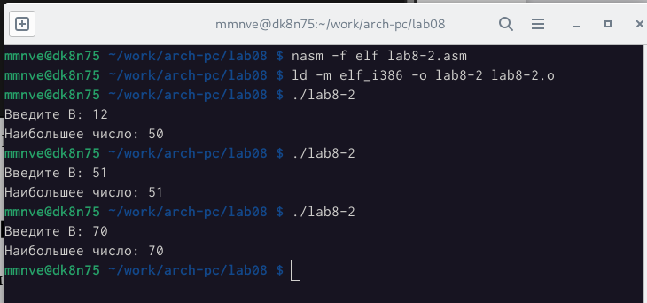
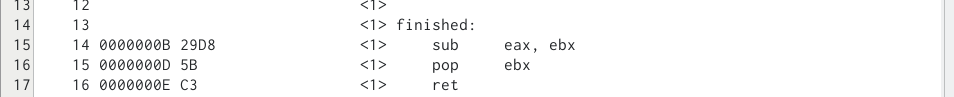

---
## Front matter
title: "Шаблон отчёта по лабораторной работе"
subtitle: "N 08"
author: "НВЕ МАНГЕ ХОСЕ ХЕРСОН МИКО, Группа: НКАбд-03-22"

## Generic otions
lang: ru-RU
toc-title: "Содержание"

## Bibliography
bibliography: bib/cite.bib
csl: pandoc/csl/gost-r-7-0-5-2008-numeric.csl

## Pdf output format
toc: true # Table of contents
toc-depth: 2
lof: true # List of figures
lot: true # List of tables
fontsize: 12pt
linestretch: 1.5
papersize: a4
documentclass: scrreprt
## I18n polyglossia
polyglossia-lang:
  name: russian
  options:
	- spelling=modern
	- babelshorthands=true
polyglossia-otherlangs:
  name: english
## I18n babel
babel-lang: russian
babel-otherlangs: english
## Fonts
mainfont: PT Serif
romanfont: PT Serif
sansfont: PT Sans
monofont: PT Mono
mainfontoptions: Ligatures=TeX
romanfontoptions: Ligatures=TeX
sansfontoptions: Ligatures=TeX,Scale=MatchLowercase
monofontoptions: Scale=MatchLowercase,Scale=0.9
## Biblatex
biblatex: true
biblio-style: "gost-numeric"
biblatexoptions:
  - parentracker=true
  - backend=biber
  - hyperref=auto
  - language=auto
  - autolang=other*
  - citestyle=gost-numeric
## Pandoc-crossref LaTeX customization
figureTitle: "Рис."
tableTitle: "Таблица"
listingTitle: "Листинг"
lofTitle: "Список иллюстраций"
lotTitle: "Список таблиц"
lolTitle: "Листинги"
## Misc options
indent: true
header-includes:
  - \usepackage{indentfirst}
  - \usepackage{float} # keep figures where there are in the text
  - \floatplacement{figure}{H} # keep figures where there are in the text
---

# Цель работы

В восьмой лабораторной работе мы узнаем о команде условных и безусловных
переходов, делая это, мы освоим использование переходов, а также познакомим-
ся со структурой файла листинга.

## Выполнение лабораторной работы :

#Реализация переходов в NASM :

1. Здесь мы начали с создания, а затем переместились в восмой каталог лабо-
ратории “~/work/arch-pc/lab08”, после чего мы создали файл “lab8-1.asm”.

{ #fig:001 width=95% }

2. После этого мы заполнили файл .asm кодом программы, отображающей
значение регистра eax.

{ #fig:002 width=95% }

- Затем мы скомпилировали файл, создали исполняемый файл и запустили
программу, все это после перемещения файла in_out.asm в тот же каталог,
где находится lab8-1.asm.

{ #fig:003 width=95% }

- После этого мы изменили код в листинге.

{ #fig:004 width=95% }

- Затем мы снова скомпилировали файл и создали исполняемый файл. 

{ #fig:005 width=95% }

- Затем мы снова изменили код в листинге ,чтобы вывод программы был
следующим:

user@dk4n31:~$ ./lab8-1
Сообщение No 3
Сообщение No 2
Сообщение No 1
user@dk4n31:~$

{ #fig:006 width=95% }

{ #fig:007 width=95% }

3. После этого мы создали файл lab8-2.asm, в который мы добавим код нашей
следующей программы .

{ #fig:008 width=95% }

- После этого мы заполнили файл необходимым кодом для Программы, ко-
торая определяет и выводит на экран наибольшую из 3 целочисленных
переменных: A,B и C .

{ #fig:009 width=95% }

- мы скомпилировали файл, создали исполняемый файл и запустили его.

{ #fig:010 width=95% }

## Изучение структуры файлы листинга :

1. Здесь и с помощью команды nasm -f elf -l lab8-2.list lab8-2.asm мы созда-
ли файл листинга файла lab8-2.asm, затем мы открыли файл с помощью
mcedit.

{ #fig:011 width=95% }

2. мы выбрали эти три строки и пытаемся объяснить каждую из них.

{ #fig:012 width=95% }

- Здесь в 18-й строке мы переместили значение адреса переменной B в ре-
гистр ecx , после этого мы поместили значение 10 в регистре edx, который
определяет размер переменной B с помощью подпрограммы sread и, нако-
нец, мы вызвали подпрограмму sread.

3. мы открыли программный файл lab 8-2.asm и удалили один операнд в
любой инструкции с двумя операндами. Мы выбрали строку под номером
27.

{ #fig:013 width=95% }

- В результате изменений был изменен файл листинга , в котором мы по-
лучили ошибку, объясняющую отсутствующий операнд, и файлы не были
созданы.

# Задание для самостоятельной работы :

## Написание программы нахождения наименьшей из 3 целочисленных переменных : Мой вариант : 13
- Мой код : 

{ #fig:014 width=95% }

- Вывод кода:

{ #fig:015 width=95% }

## Написание программы, которая выполняет математическую операцию в зависимости от значениявведенных переменных :

- Мой код :

{ #fig:016 width=95% }

- Вывод кода:

{ #fig:017 width=95% }

## Выводы по результатам выполнения заданий :

- В этой части мы смогли применить наш полученный навык понятным
способом, заставив программу вычислять конечное значение в зависимости
от значений введенных переменных с использованием условных переходов.

# Выводы, согласованные с целью работы :

- В восьмой лаборатории мы в основном узнали, как использовать условные
и безусловные переходы в NASM, как читать структуру файла листинга.

::: {#refs}
:::
